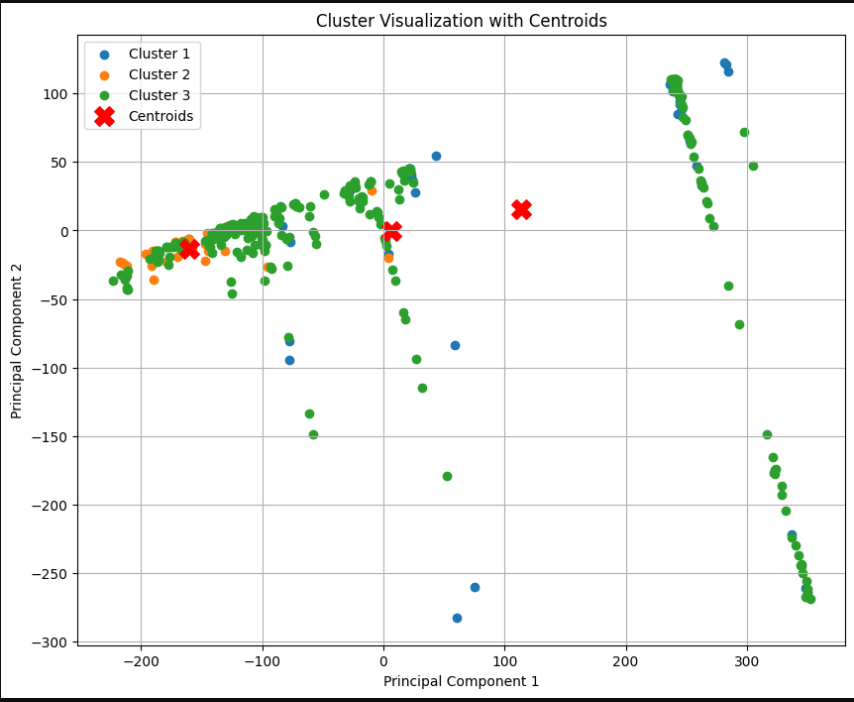

---

# **📊 Weighted Clusterwise Linear Regression using Adaptive Quadratic Distance**

## **📌 Overview**

This project implements **Weighted Clusterwise Linear Regression (WCLR)** using an **Adaptive Quadratic Distance** metric. It combines clustering and regression by introducing adaptive weight matrices to enhance accuracy and interpretability.

✅ **Hybrid approach of Clustering & Regression**\
✅ **Adaptive Weighting using Inverse Covariance**\
✅ **Quadratic Distance-based Cluster Assignment**\
✅ **Application to Housing Price Prediction, Anomaly Detection, and Customer Segmentation**

---

## **🛠 Technologies Used**

- **Programming Language:** Python
- **Libraries:** NumPy, Pandas, Scikit-learn, Matplotlib, Seaborn
- **Machine Learning Models:** K-Means Clustering, Linear Regression
- **Visualization Tools:** PCA-based Cluster Visualization

---

## **📂 Project Structure**

```
📁 Weighted-CLR  
│-- 📂 data/             # Dataset files  
│-- 📂 src/              # Jupyter Notebook for clustering & regression  
│-- 📂 images/           # Cluster visualizations & regression plots  
│-- 📂 reports/          # Research papers & documentation  
│-- 📜 README.md         # Project documentation  
│-- 📜 requirements.txt  # Dependencies  
```

---

## **⚡ How to Install & Run**

1. **Clone the repository:**
   ```bash
   git clone https://github.com/yourusername/Weighted-CLR.git
   cd Weighted-CLR
   ```
2. **Install dependencies:**
   ```bash
   pip install -r requirements.txt
   ```
3. **Run the Jupyter Notebook:**
   ```bash
   jupyter notebook src/main.ipynb
   ```
4. **Train the model and visualize clusters:**
   ```bash
   jupyter notebook src/train_model.ipynb
   ```
5. **Predict for a new data point:**
   ```bash
   jupyter notebook src/predict.ipynb
   ```

---

## **📊 Algorithm Workflow**

1️⃣ **Initialization:** Assign data points randomly to clusters and initialize weight matrices.\
2️⃣ **Representation:** Update cluster centroids using the mean of assigned points.\
3️⃣ **Weighting:** Compute **adaptive weight matrices** using the inverse covariance of cluster points.\
4️⃣ **Modeling:** Train **Linear Regression models** for each cluster.\
5️⃣ **Assignment:** Reassign data points based on **quadratic distance** and regression error.\
6️⃣ **Stopping Criteria:** Repeat until **convergence** is reached.

---

## **🌟 Key Features**

- **📌 Adaptive Quadratic Distance Calculation** – Uses weighted distance metrics
- **📈 Clusterwise Linear Regression** – Assigns separate regression models per cluster
- **🔍 Feature Engineering & Preprocessing** – Removes NaN values, normalizes data
- **📊 Data Visualization** – PCA-based cluster plots and regression analysis

---

## **📸 Screenshots & Demo**

📌 **Cluster Visualization**

.

---

## **📌 Future Plans**

🚀 **Extend to Deep Learning Models** – Implement clustering with Neural Networks\
🔍 **Large-Scale Dataset Handling** – Optimize for big data applications\
📊 **Alternative Weighting Methods** – Experiment with kernel-based weighting functions

---

## **📜 License**

This project is **open-source and for educational purposes only**.

---


